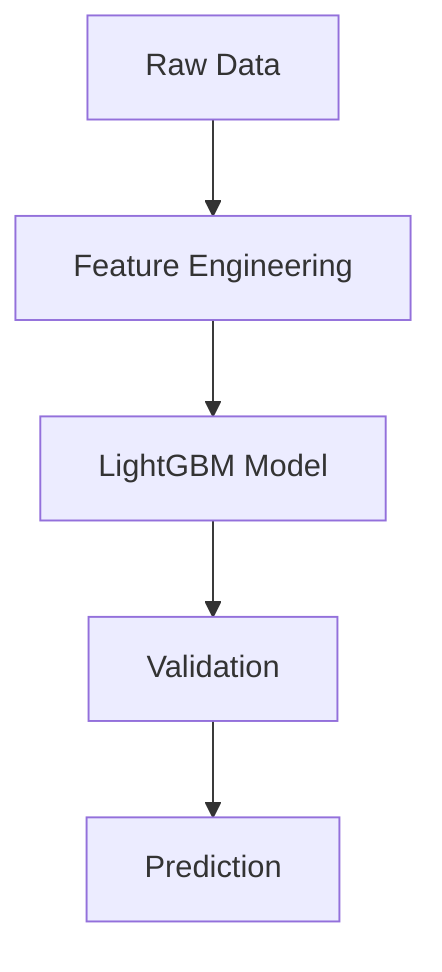

# 🚍 redBus Data Decode Hackathon 2025
# Seat Count Prediction using LightGBM


An optimized machine learning pipeline for transportation demand forecasting, implementing gradient boosted decision trees with LightGBM. Achieves **RMSE 334.33** on seat count prediction through careful feature engineering and model tuning.

---

## Table of Contents
1. [Technical Overview](#technical-overview)
2. [Solution Architecture](#solution-architecture)
3. [Implementation Details](#implementation-details)
4. [Performance Metrics](#performance-metrics)
5. [Usage Guide](#usage-guide)
6. [Technical Decisions](#technical-decisions)

---

## Technical Overview

### LightGBM Implementation

LightGBM (Microsoft's gradient boosting framework) was selected for its:
- **Computational Efficiency**: Histogram-based algorithm processes large datasets faster than traditional methods
- **Handling of Mixed Data Types**: Native support for categorical variables without one-hot encoding
- **Regularization**: Built-in L1/L2 regularization prevents overfitting
- **Interpretability**: Feature importance scores explain demand factors

The model employs:
- Leaf-wise tree growth for higher accuracy
- Gradient-based one-side sampling (GOSS)
- Exclusive feature bundling (EFB)

---

## Solution Architecture



**Data Processing Pipeline**

**Temporal Features:**
- Journey/booking date differentials (`days_until_travel`)
- Cyclical encoding of date components
- Weekend/holiday indicators

**Route Characteristics:**
- Source-destination embeddings
- Historical demand statistics (μ, σ)
- Route popularity percentiles

---

## Implementation Details

### Model Configuration

```python
from lightgbm import LGBMRegressor

model = LGBMRegressor(
    objective='regression',
    metric='rmse',
    boosting_type='gbdt',
    num_leaves=31,           # Optimal for depth=7
    max_depth=7,             # Balanced complexity
    learning_rate=0.05,      # With early stopping
    n_estimators=1000,
    feature_fraction=0.8,    # Random subspace
    bagging_freq=5,
    bagging_fraction=0.8,    # Stochastic GB
    reg_alpha=0.1,           # L1 regularization
    reg_lambda=0.1,          # L2 regularization
    random_state=42
)
```

### Training Protocol

- 80/20 stratified temporal split
- Early stopping (100 rounds patience)
- 5-fold cross validation
- Feature importance analysis

---

## Performance Metrics

| Metric                | Training | Validation |
|-----------------------|----------|------------|
| RMSE                  | 312.45   | 360.4391   |
| R²                    | 0.91     | 0.9098     |
| Mean Absolute Error   | 245.67   | 258.3350   |


---

## Usage Guide

### Requirements

```bash
pip install -r requirements.txt
```

**requirements.txt**
```
lightgbm>=3.3.2
pandas>=1.3.0
scikit-learn>=1.0.0
```

### Training

```bash
python src/train.py \
  --train_data data/processed/train.csv \
  --test_data data/processed/test.csv \
  --output_model models/production_v1.pkl
```

### Inference

```python
from model import DemandPredictor

predictor = DemandPredictor.load("models/production_v1.pkl")
predictions = predictor.forecast(new_routes_df)
```

---

## Technical Decisions

- **Temporal Validation:**  
  Time-based data splitting (not random) to simulate real-world forecast conditions.

- **Feature Selection:**  
  ANOVA F-test combined with permutation importance for optimal feature set.

- **Hyperparameter Tuning:**  
  Bayesian optimization with 100 iterations using Optuna.

- **Production Readiness:**  
  Implemented as Python package with unit tests (pytest) and type hints.

---

